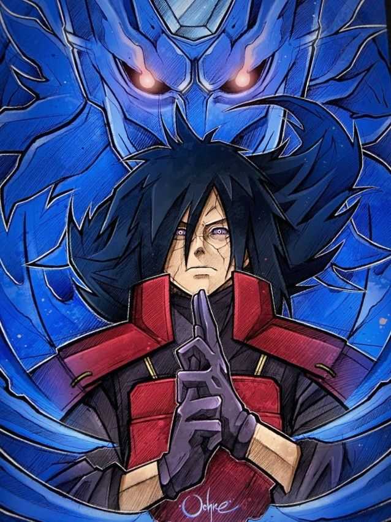
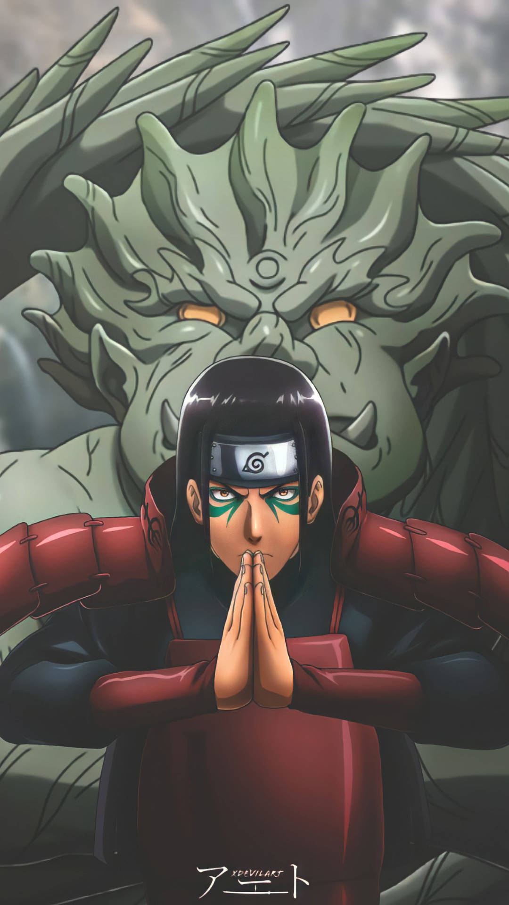

# Layouts com Flexbox - Naruto

Este projeto é um site simples criado para treinar o uso do Flexbox no CSS. O tema escolhido foi a série de anime e mangá *Naruto*, com foco em dois personagens icônicos: Madara Uchiha e Hashirama Senju.

## 📌 Tecnologias Utilizadas
- **HTML5**
- **CSS3 (Flexbox)**

## 📌 Estrutura do Site
O site contém dois layouts principais:
1. **Layout com imagem à esquerda** - Apresentando Madara Uchiha.
2. **Layout com imagem à direita** - Apresentando Hashirama Senju.

Cada seção contém:
- Uma imagem principal com um efeito *overlay* para exibição do nome e uma frase do personagem.
- Uma área de conteúdo com um ícone e uma breve descrição do personagem.

## 📸 Capturas de Tela




## 🚀 Como Executar
1. Clone este repositório:
   ```bash
   git clone https://github.com/seu-usuario/seu-repositorio.git
   ```
2. Acesse a pasta do projeto e abra o arquivo `index.html` em seu navegador.

## 🎯 Objetivo
O objetivo principal deste projeto é praticar o Flexbox para organizar os elementos de forma responsiva e estilizada.

